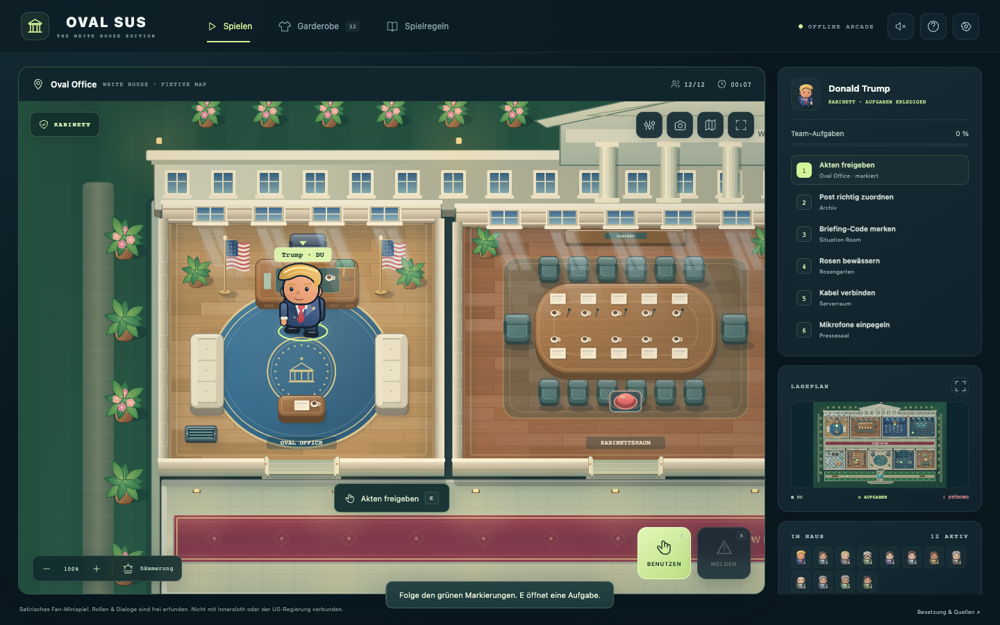
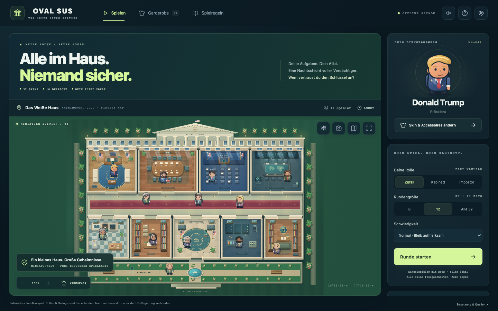
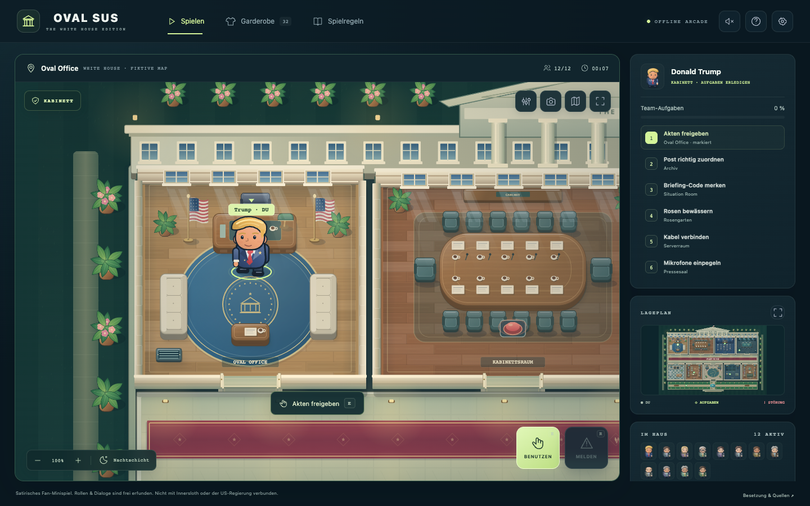
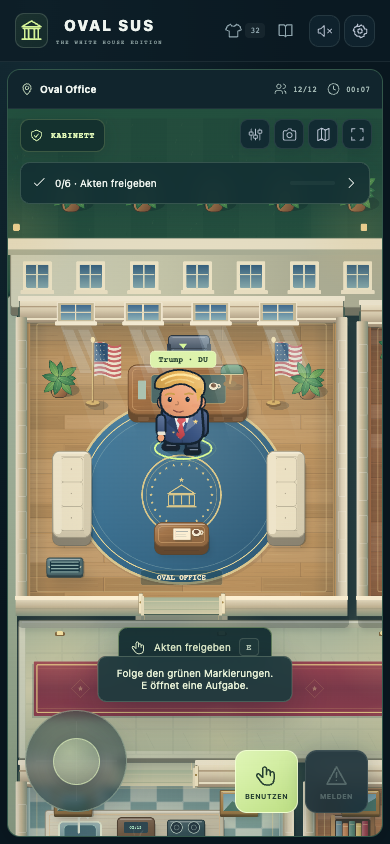
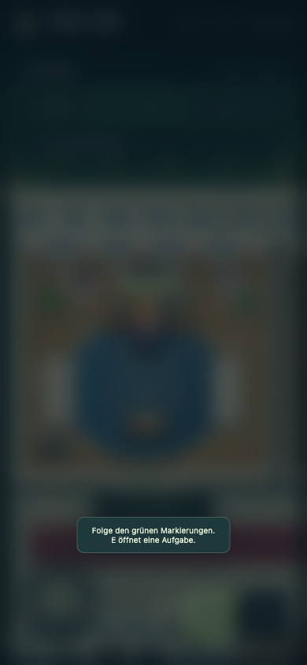
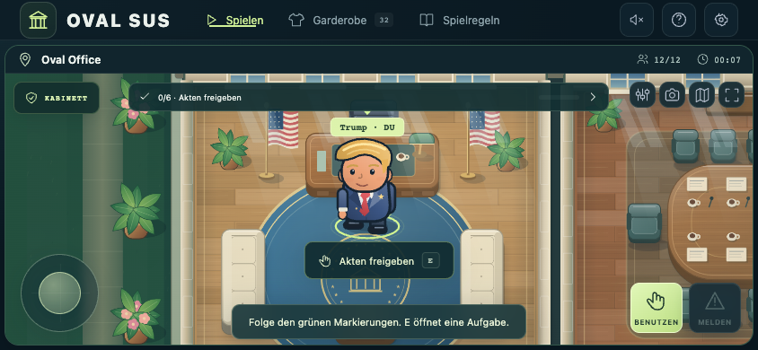

# OVAL SUS — Miniature Edition

Ein satirisches Social-Deduction-Minispiel in einer frei erfundenen Miniaturversion des Weißen Hauses. **Eine HTML-Datei. Kein Build. Kein Login. Keine externen Laufzeit-Abhängigkeiten.**

## Spielen

**[Im Browser spielen](https://martin-hausleitner.github.io/OVAL-SUS/)** · [HTML-Quelldatei](index.html)

Offline: `index.html` herunterladen und im Browser öffnen. Die Website auf GitHub Pages wird aus `main` im Repository-Hauptverzeichnis bereitgestellt.



## Spiel & Grafik

32 Karikatur-Skins mit Accessoires, Bot-Runden mit 8, 12 oder 32 Figuren, neun Aufgabenstationen und zehn Bereiche. Aufgaben, Sabotage, Reparaturen, Besprechungen und Abstimmungen sind in derselben HTML-Datei enthalten.

Die Miniature Edition ergänzt räumliche Möbel und Wände, Parkett, Fensterlicht, Schatten, Pflanzen, drei Lichtstimmungen, verstellbare Grafikdetails sowie den PNG-Fotomodus. Handy-Hochformat und Querformat haben eigene Layouts.

**Einzelspieler mit Bots. Kein Online-Multiplayer.** Namen und Kostüme dienen der Satire. Spielrollen und Ereignisse sind frei erfunden und keine Behauptungen über reale Personen. Die Skins sind kein aktuelles amtliches Regierungsverzeichnis. Kein offizielles Spiel von Innersloth oder einer Regierungsstelle.

## Screenshots

Die Bilder wurden für diesen Publish aus der unveränderten Anwendung mit Chrome auf macOS aufgenommen.

### Lobby


### Nachtschicht


### Handy und Minispiel
 

### Querformat


## Bedienung

| Aktion | Computer |
| --- | --- |
| Bewegen | WASD / Pfeiltasten |
| Benutzen | E |
| Melden | R |
| Ausschalten | Q |
| Sabotage | X |
| Lüftung | V |
| Karte | M |
| Pause | Esc |

Am Handy: Bildschirm-Joystick und Aktionsschaltflächen. Spielfortschritt und Einstellungen werden lokal im Browser gespeichert.

## Prüfung

**33/33 automatisierte Publish-Prüfungen bestanden** — Desktop (1440 × 900), Handy (390 × 844) und Querformat (844 × 390), mit isolierten Browserprofilen. Geprüft wurden unter anderem Canvas-Start, 32 Skins, Rundenstart, Tastaturbewegung, alle neun Aufgabenwege, sichtbare Aktionsschaltflächen, der Weg ins Oval Office, Nachtlicht, PNG-Fotomodus und das Kabel-Minispiel. Keine unbehandelten JavaScript-Fehler in diesem Lauf.

[Maschinenlesbarer Testbericht](evidence/publish-smoke-local.json) · [Prüfgrenzen und erster Testlauf](evidence/README.md) · [Quell-Prüfsumme](evidence/source-provenance.json)

Safari und physische iOS-/Android-Geräte sind **nicht separat geprüft**. Mobile Ansichten wurden in Chrome emuliert. Der Testbericht ist kein Beleg für nicht ausgeführte Hardwaretests.

### Tests wiederholen

Die Anwendung selbst braucht keine Installation. Nur für die Entwicklungstests werden Python, Playwright und ein installiertes Google Chrome benötigt:

```sh
python3 -m venv .venv
. .venv/bin/activate
python3 -m pip install playwright
python3 tests/smoke.py
# Optional: dieselben Tests gegen die bereitgestellte Seite
python3 tests/smoke.py --url https://martin-hausleitner.github.io/OVAL-SUS/ --tag live
```

Die QA-Schnittstelle ist nur mit `?test=1` verfügbar. Die Tests schreiben echte Browser-Screenshots und JSON-Evidence neu. `SHA256SUMS` dokumentiert die zum Commit gehörenden Dateien; nach erneuten Tests ändern sich Screenshot- und Report-Prüfsummen.

## Dateien

`index.html` ist die vollständige Anwendung. `screenshots/` enthält die Browser-Aufnahmen, `tests/smoke.py` den reproduzierbaren Publish-Check und `evidence/` die Prüfberichte. **Der Spielcode ist byte-identisch mit `OVAL-SUS-Miniature-Edition.html` aus dem Chat.**
